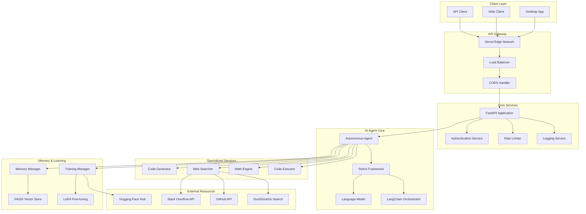
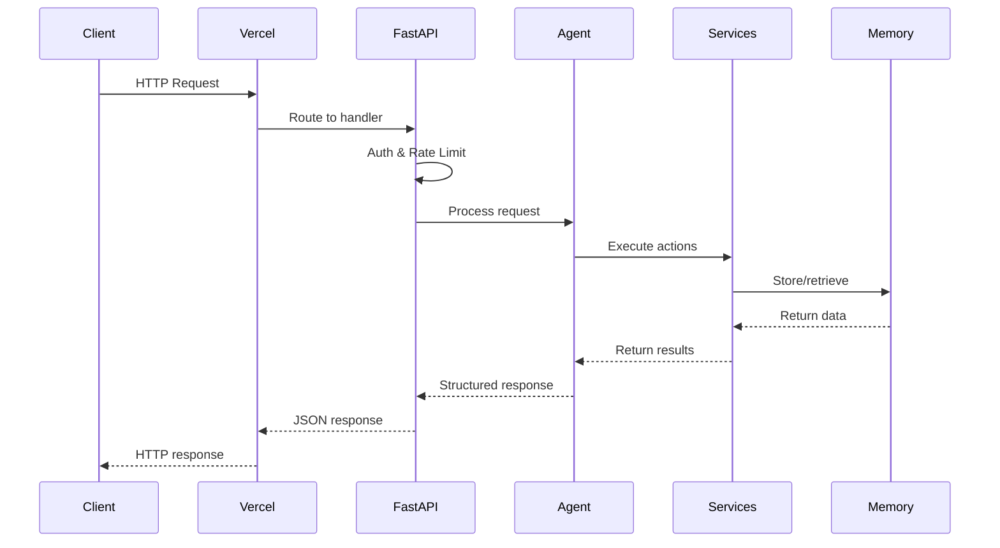
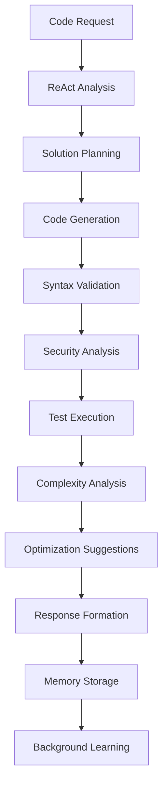
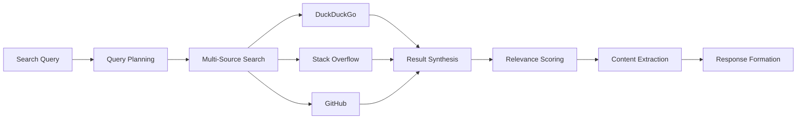

# Architecture Documentation

## System Overview

The Autonomous AI Agent is designed as a distributed, microservices-based architecture optimized for serverless deployment on Vercel. The system implements the ReAct (Reasoning + Acting) framework for autonomous decision-making and incorporates advanced machine learning capabilities for continuous improvement.

## High-Level Architecture



## Component Architecture

### 1. FastAPI Application Layer

**Location**: `api/index.py`

The main application entry point implementing:

- **RESTful API endpoints** with OpenAPI documentation
- **Async request handling** for concurrent operations
- **Middleware stack** for authentication, CORS, logging
- **Error handling** with structured responses
- **Background tasks** for non-blocking operations

```python
# Core endpoints structure
/generate    # Code generation with analysis
/search      # Multi-source web search
/reason      # Step-by-step problem solving
/train       # Self-training triggers
/status      # System health and metrics
/feedback    # User feedback collection
```

### 2. Autonomous Agent Core

**Location**: `api/agent_core.py`

The brain of the system implementing:

#### ReAct Framework
```python
# ReAct Cycle
Thought: "I need to solve this coding problem step by step"
Action: "Search for similar algorithms and generate solution"
Observation: "Found relevant examples, generating optimized code"
```

#### Components:
- **Conversation Chain**: LangChain-based dialogue management
- **Output Parser**: Structured response parsing
- **Performance Tracking**: Interaction quality metrics
- **Self-Improvement Loop**: Continuous learning from feedback

### 3. Utility Services

#### Authentication Service (`utils/auth.py`)
- **JWT Token Management**: Secure token generation and validation
- **Role-Based Access**: Admin, user, anonymous tiers
- **Rate Limiting Integration**: Token-based usage control

#### Rate Limiter (`utils/rate_limiter.py`)
- **Token Bucket Algorithm**: Smooth rate limiting
- **Adaptive Limits**: User role-based quotas
- **Burst Handling**: Short-term spike management

#### Structured Logging (`utils/logger.py`)
- **JSON Format**: Machine-readable logs
- **Performance Tracking**: Request timing and metrics
- **Error Categorization**: Structured error reporting

### 4. Web Search Engine

**Location**: `utils/web_search.py`

Multi-source search implementation:

```python
# Search Sources
DuckDuckGo Search    # Free, no API key required
Stack Overflow API   # Programming Q&A
GitHub API          # Code repositories
Documentation Sites # Official docs
```

#### Features:
- **Concurrent Searches**: Parallel API calls
- **Result Synthesis**: Information consolidation
- **Relevance Scoring**: Content quality assessment
- **Caching**: Response optimization

### 5. Code Execution Engine

**Location**: `utils/code_executor.py`

Safe code execution environment:

#### Security Measures:
- **AST Parsing**: Syntax validation
- **Pattern Detection**: Dangerous operation identification
- **Sandboxed Execution**: Isolated subprocess execution
- **Timeout Protection**: Resource limit enforcement

#### Analysis Features:
- **Complexity Analysis**: Big O notation calculation
- **Performance Metrics**: Execution time and memory usage
- **Test Generation**: Automatic test case creation
- **Optimization Suggestions**: Code improvement recommendations

### 6. Mathematical Engine

**Location**: `utils/math_engine.py`

Comprehensive mathematical analysis:

#### Calculus Operations:
```python
# Symbolic computation
∂/∂x (x² + 3x + 2) = 2x + 3

# Numerical integration
∫₀¹ x² dx = 1/3
```

#### Statistical Analysis:
- **Descriptive Statistics**: Mean, median, mode, standard deviation
- **Hypothesis Testing**: T-tests, chi-square tests
- **Confidence Intervals**: Statistical significance assessment
- **Distribution Analysis**: Normality testing, outlier detection

#### Algorithm Analysis:
- **Time Complexity**: Automated Big O calculation
- **Space Complexity**: Memory usage analysis
- **Optimization Opportunities**: Performance improvement suggestions

### 7. Memory Management System

**Location**: `utils/memory_manager.py`

FAISS-based vector memory:

#### Memory Types:
- **Episodic Memory**: Specific interactions and experiences
- **Semantic Memory**: General knowledge and concepts
- **Code Memory**: Programming-specific information

#### Features:
- **Vector Embeddings**: Sentence transformer-based similarity
- **Similarity Search**: Fast k-NN retrieval with FAISS
- **Memory Consolidation**: Importance-based pruning
- **Persistent Storage**: Long-term memory retention

### 8. Training Management System

**Location**: `utils/training_manager.py`

Self-training and improvement:

#### Training Methods:
```python
# LoRA Fine-tuning
LoraConfig(
    task_type=TaskType.CAUSAL_LM,
    r=8,                    # Low rank
    lora_alpha=32,          # Scaling
    lora_dropout=0.1,       # Regularization
    target_modules=["q_proj", "v_proj"]
)

# RLHF Process
1. Collect user feedback
2. Train reward model
3. Optimize policy with PPO
4. Validate improvements
```

#### Dataset Management:
- **Hugging Face Integration**: External dataset loading
- **Interaction Data**: User session conversion to training data
- **Synthetic Generation**: Automated data augmentation
- **Quality Filtering**: High-quality example selection

## Data Flow Architecture

### 1. Request Processing Flow



### 2. Code Generation Flow



### 3. Search Integration Flow



## Deployment Architecture

### Vercel Serverless Functions

```json
{
  "builds": [
    {
      "src": "api/index.py",
      "use": "@vercel/python",
      "config": {
        "maxLambdaSize": "50mb"
      }
    }
  ],
  "functions": {
    "api/index.py": {
      "maxDuration": 300
    }
  }
}
```

### Resource Optimization

#### Memory Management:
- **CPU-only PyTorch**: Reduced memory footprint
- **Model Quantization**: 4-bit precision for efficiency
- **Lazy Loading**: On-demand module imports
- **Caching**: Response and computation caching

#### Performance Optimization:
- **Async Operations**: Non-blocking I/O
- **Connection Pooling**: Efficient HTTP clients
- **Batch Processing**: Vectorized operations
- **Edge Caching**: CDN optimization

## Security Architecture

### Authentication & Authorization

```python
# JWT Token Structure
{
  "sub": "user_id",
  "username": "user",
  "role": "admin|user|anonymous",
  "exp": 1234567890,
  "iat": 1234567890
}
```

### Input Validation

```python
# Code Safety Patterns
dangerous_patterns = [
    r'import\s+os',
    r'exec\s*\(',
    r'eval\s*\(',
    r'subprocess',
    r'__import__'
]
```

### Rate Limiting

```python
# Token Bucket Algorithm
bucket_capacity = 10      # Burst size
refill_rate = 1.0        # Tokens per second
time_window = 60         # Seconds
```

## Monitoring & Observability

### Structured Logging

```json
{
  "timestamp": "2024-01-01T00:00:00Z",
  "level": "INFO",
  "logger": "autonomous_agent",
  "message": "Code generation completed",
  "duration_ms": 1500,
  "user_id": "user123",
  "operation": "code_generation",
  "success": true
}
```

### Performance Metrics

- **Request Latency**: P50, P95, P99 percentiles
- **Error Rates**: 4xx, 5xx error tracking
- **Model Performance**: Perplexity, accuracy scores
- **Resource Usage**: Memory, CPU utilization

### Health Checks

```python
# System Health Indicators
{
  "status": "healthy",
  "model_loaded": true,
  "memory_usage": 0.75,
  "avg_response_time": 2.5,
  "error_rate": 0.02
}
```

## Scalability Considerations

### Horizontal Scaling

- **Stateless Functions**: No server-side state
- **Auto-scaling**: Vercel's automatic scaling
- **Load Distribution**: Geographic edge deployment
- **Resource Isolation**: Function-level isolation

### Vertical Scaling

- **Model Optimization**: Distilled models for efficiency
- **Memory Management**: Efficient data structures
- **Computation Optimization**: Vectorized operations
- **I/O Optimization**: Async and concurrent processing

## Future Architecture Enhancements

### Planned Improvements

1. **Multi-Model Support**: Multiple specialized models
2. **Distributed Training**: Cross-function training coordination
3. **Real-time Learning**: Streaming model updates
4. **Advanced Memory**: Hierarchical memory structures
5. **Plugin System**: Extensible tool integration

### Research Directions

1. **Federated Learning**: Privacy-preserving training
2. **Meta-Learning**: Few-shot adaptation
3. **Causal Reasoning**: Advanced logical inference
4. **Multi-modal Integration**: Code, text, and visual understanding

---

This architecture provides a robust, scalable foundation for an autonomous AI agent while maintaining simplicity and cost-effectiveness through serverless deployment.
