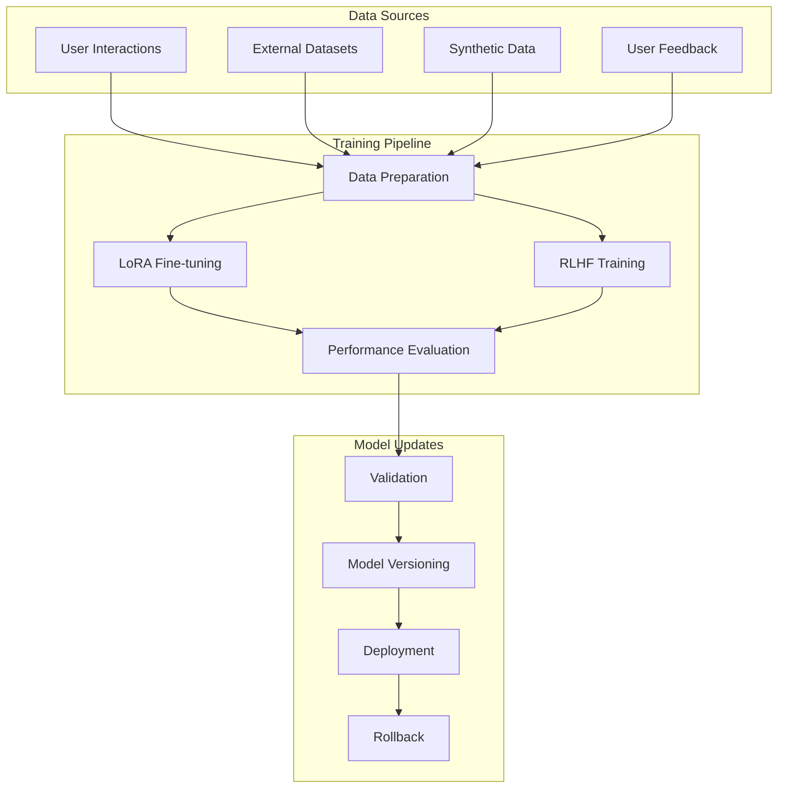

# Training Documentation

## Overview

The Autonomous AI Agent implements a sophisticated self-training system that enables continuous improvement through various learning mechanisms. This document covers the mathematical foundations, implementation details, and practical aspects of training the agent.

## Training Architecture

### Core Training Components



## Mathematical Foundations

### 1. LoRA (Low-Rank Adaptation)

LoRA reduces the number of trainable parameters by decomposing weight updates into low-rank matrices.

#### Mathematical Formulation

For a pretrained weight matrix W₀ ∈ ℝᵈˣᵏ, LoRA represents the update as:

```
W = W₀ + ΔW = W₀ + BA
```

Where:
- B ∈ ℝᵈˣʳ (down-projection matrix)
- A ∈ ℝʳˣᵏ (up-projection matrix)  
- r << min(d,k) (rank constraint)

The forward pass becomes:
```
h = W₀x + ΔWx = W₀x + BAx
```

#### Parameter Efficiency

Original parameters: d × k
LoRA parameters: d × r + r × k = r(d + k)

Reduction ratio: r(d + k) / (d × k) = r(1/k + 1/d)

#### Implementation

```python
from peft import LoraConfig, get_peft_model, TaskType

# LoRA configuration for causal language modeling
lora_config = LoraConfig(
    task_type=TaskType.CAUSAL_LM,
    inference_mode=False,
    r=8,                    # Rank (controls parameter count)
    lora_alpha=32,          # Scaling factor (α)
    lora_dropout=0.1,       # Dropout for regularization
    target_modules=[        # Modules to apply LoRA
        "q_proj",           # Query projection
        "v_proj",           # Value projection  
        "k_proj",           # Key projection
        "o_proj"            # Output projection
    ]
)

# Apply LoRA to base model
model = AutoModelForCausalLM.from_pretrained("distilgpt2")
peft_model = get_peft_model(model, lora_config)

# Training efficiency
print(f"Trainable parameters: {peft_model.num_parameters(only_trainable=True):,}")
print(f"Total parameters: {peft_model.num_parameters():,}")
```

### 2. RLHF (Reinforcement Learning from Human Feedback)

RLHF aligns model behavior with human preferences through reward-based optimization.

#### Mathematical Framework

1. **Reward Model Training**
   ```
   Loss_RM = -𝔼[(r_θ(x,y₁) - r_θ(x,y₂)) * sigmoid(y₁ ≻ y₂)]
   ```

2. **Policy Optimization (PPO)**
   ```
   L^CLIP(θ) = 𝔼[min(r_t(θ)Â_t, clip(r_t(θ), 1-ε, 1+ε)Â_t)]
   ```
   
   Where:
   - r_t(θ) = π_θ(a_t|s_t) / π_θ_old(a_t|s_t) (probability ratio)
   - Â_t = advantage estimate
   - ε = clipping parameter

3. **Value Function**
   ```
   L^VF(θ) = 𝔼[(V_θ(s_t) - V_target)²]
   ```

#### RLHF Training Process

```python
async def rlhf_training_step(interactions, reward_model):
    """Single RLHF training step"""
    
    # 1. Generate responses
    responses = []
    for interaction in interactions:
        response = await model.generate(interaction["prompt"])
        responses.append(response)
    
    # 2. Compute rewards
    rewards = []
    for prompt, response in zip([i["prompt"] for i in interactions], responses):
        reward = reward_model.score(prompt, response)
        rewards.append(reward)
    
    # 3. Compute advantages
    advantages = compute_advantages(rewards)
    
    # 4. PPO update
    loss = ppo_loss(responses, advantages)
    
    return loss

def compute_advantages(rewards, values=None, gamma=0.99, lam=0.95):
    """Compute Generalized Advantage Estimation (GAE)"""
    if values is None:
        values = [0] * len(rewards)
    
    advantages = []
    gae = 0
    
    for i in reversed(range(len(rewards))):
        if i == len(rewards) - 1:
            next_value = 0
        else:
            next_value = values[i + 1]
        
        delta = rewards[i] + gamma * next_value - values[i]
        gae = delta + gamma * lam * gae
        advantages.insert(0, gae)
    
    return advantages
```

### 3. Gradient Descent Optimization

The agent uses Adam optimizer with the following update rules:

```
m_t = β₁m_{t-1} + (1-β₁)g_t
v_t = β₂v_{t-1} + (1-β₂)g_t²

m̂_t = m_t / (1-β₁ᵗ)
v̂_t = v_t / (1-β₂ᵗ)

θ_t = θ_{t-1} - α * m̂_t / (√v̂_t + ε)
```

Where:
- g_t = ∇_θL_t (gradient)
- α = learning rate
- β₁, β₂ = momentum parameters
- ε = numerical stability constant

## Training Data Management

### 1. Interaction Data Processing

```python
async def prepare_interaction_data(interactions: List[Dict]) -> Dataset:
    """Convert interactions to training format"""
    
    training_examples = []
    
    for interaction in interactions:
        if interaction["type"] == "code_generation":
            # Format as instruction-following
            prompt = interaction["request"]["prompt"]
            code = interaction["response"]["code"]
            explanation = interaction["response"]["explanation"]
            
            text = f"""### Instruction:
{prompt}

### Code:
{code}

### Explanation:
{explanation}"""
            
            training_examples.append({"text": text})
    
    return Dataset.from_list(training_examples)
```

### 2. Synthetic Data Generation

```python
def generate_synthetic_training_data(base_examples: List[str], num_synthetic: int) -> List[str]:
    """Generate synthetic training data using data augmentation"""
    
    synthetic_examples = []
    
    # Code mutation strategies
    mutations = [
        variable_renaming,
        comment_addition,
        style_variation,
        complexity_variation
    ]
    
    for _ in range(num_synthetic):
        base_example = random.choice(base_examples)
        mutation = random.choice(mutations)
        synthetic_example = mutation(base_example)
        synthetic_examples.append(synthetic_example)
    
    return synthetic_examples

def variable_renaming(code: str) -> str:
    """Rename variables while preserving semantics"""
    # Parse AST and rename variables
    tree = ast.parse(code)
    renamer = VariableRenamer()
    new_tree = renamer.visit(tree)
    return ast.unparse(new_tree)
```

### 3. Quality Filtering

```python
def filter_training_data(examples: List[Dict], quality_threshold: float = 0.7) -> List[Dict]:
    """Filter training data based on quality metrics"""
    
    filtered_examples = []
    
    for example in examples:
        quality_score = calculate_quality_score(example)
        
        if quality_score >= quality_threshold:
            filtered_examples.append(example)
    
    return filtered_examples

def calculate_quality_score(example: Dict) -> float:
    """Calculate quality score based on multiple factors"""
    
    factors = {
        "syntax_validity": check_syntax_validity(example["text"]),
        "semantic_coherence": check_semantic_coherence(example["text"]),
        "complexity_appropriateness": check_complexity(example["text"]),
        "documentation_quality": check_documentation(example["text"])
    }
    
    weights = {
        "syntax_validity": 0.3,
        "semantic_coherence": 0.3,
        "complexity_appropriateness": 0.2,
        "documentation_quality": 0.2
    }
    
    score = sum(factors[key] * weights[key] for key in factors)
    return score
```

## Training Procedures

### 1. LoRA Fine-tuning

```python
async def fine_tune_with_lora(dataset: Dataset, model_name: str = "distilgpt2") -> Dict:
    """Fine-tune model using LoRA"""
    
    # Load base model
    model = AutoModelForCausalLM.from_pretrained(
        model_name,
        torch_dtype=torch.float32,
        device_map="cpu"
    )
    
    # Apply LoRA
    peft_model = get_peft_model(model, lora_config)
    
    # Tokenize dataset
    tokenized_dataset = dataset.map(
        lambda x: tokenizer(
            x["text"],
            truncation=True,
            padding=True,
            max_length=512
        ),
        batched=True
    )
    
    # Training arguments
    training_args = TrainingArguments(
        output_dir="./lora_training",
        num_train_epochs=3,
        per_device_train_batch_size=2,
        per_device_eval_batch_size=2,
        warmup_steps=100,
        weight_decay=0.01,
        logging_steps=10,
        evaluation_strategy="steps",
        eval_steps=50,
        save_strategy="steps",
        save_steps=100,
        load_best_model_at_end=True,
        metric_for_best_model="eval_loss",
        greater_is_better=False,
        fp16=False,  # CPU training
        dataloader_pin_memory=False
    )
    
    # Data collator
    data_collator = DataCollatorForLanguageModeling(
        tokenizer=tokenizer,
        mlm=False
    )
    
    # Initialize trainer
    trainer = Trainer(
        model=peft_model,
        args=training_args,
        train_dataset=tokenized_dataset["train"],
        eval_dataset=tokenized_dataset["eval"],
        data_collator=data_collator,
        tokenizer=tokenizer
    )
    
    # Train
    train_result = trainer.train()
    
    # Evaluate
    eval_result = trainer.evaluate()
    
    return {
        "train_result": train_result,
        "eval_result": eval_result,
        "model_path": training_args.output_dir
    }
```

### 2. Reinforcement Learning Training

```python
async def rlhf_training(interactions: List[Dict], num_epochs: int = 5) -> Dict:
    """RLHF training implementation"""
    
    # Prepare reward model
    reward_model = RewardModel()
    
    # Training loop
    for epoch in range(num_epochs):
        epoch_rewards = []
        epoch_losses = []
        
        for batch in batch_interactions(interactions, batch_size=4):
            # Generate responses
            responses = []
            for interaction in batch:
                response = model.generate(interaction["prompt"])
                responses.append(response)
            
            # Compute rewards
            rewards = []
            for prompt, response in zip([i["prompt"] for i in batch], responses):
                reward = reward_model.compute_reward(prompt, response)
                rewards.append(reward)
            
            # Compute policy loss
            loss = compute_ppo_loss(responses, rewards)
            
            # Backward pass
            loss.backward()
            optimizer.step()
            optimizer.zero_grad()
            
            epoch_rewards.extend(rewards)
            epoch_losses.append(loss.item())
        
        # Log epoch metrics
        avg_reward = np.mean(epoch_rewards)
        avg_loss = np.mean(epoch_losses)
        
        print(f"Epoch {epoch}: Reward={avg_reward:.3f}, Loss={avg_loss:.3f}")
    
    return {
        "final_reward": avg_reward,
        "final_loss": avg_loss,
        "training_complete": True
    }

class RewardModel:
    """Simple reward model based on feedback analysis"""
    
    def __init__(self):
        self.positive_indicators = [
            "correct", "accurate", "efficient", "well-documented",
            "clean", "optimized", "readable", "comprehensive"
        ]
        self.negative_indicators = [
            "incorrect", "buggy", "inefficient", "unclear",
            "messy", "incomplete", "confusing", "wrong"
        ]
    
    def compute_reward(self, prompt: str, response: str) -> float:
        """Compute reward based on response quality"""
        
        # Base reward
        reward = 0.5
        
        # Syntax validity check
        if self.is_syntactically_valid(response):
            reward += 0.2
        else:
            reward -= 0.3
        
        # Semantic appropriateness
        semantic_score = self.compute_semantic_score(prompt, response)
        reward += semantic_score * 0.3
        
        # Code quality indicators
        quality_score = self.compute_quality_score(response)
        reward += quality_score * 0.2
        
        return max(0.0, min(1.0, reward))
    
    def is_syntactically_valid(self, code: str) -> bool:
        """Check if code is syntactically valid"""
        try:
            ast.parse(code)
            return True
        except SyntaxError:
            return False
    
    def compute_semantic_score(self, prompt: str, response: str) -> float:
        """Compute semantic appropriateness score"""
        # Use embedding similarity or simple keyword matching
        prompt_words = set(prompt.lower().split())
        response_words = set(response.lower().split())
        
        overlap = len(prompt_words.intersection(response_words))
        total = len(prompt_words.union(response_words))
        
        return overlap / total if total > 0 else 0.0
    
    def compute_quality_score(self, response: str) -> float:
        """Compute code quality score"""
        positive_count = sum(1 for indicator in self.positive_indicators 
                           if indicator in response.lower())
        negative_count = sum(1 for indicator in self.negative_indicators 
                           if indicator in response.lower())
        
        # Normalize to [0, 1]
        max_indicators = len(self.positive_indicators)
        score = (positive_count - negative_count) / max_indicators
        
        return max(0.0, min(1.0, (score + 1) / 2))
```

### 3. Continuous Learning

```python
async def continuous_learning_loop():
    """Continuous learning from interactions"""
    
    learning_threshold = 100  # Trigger training after N interactions
    interaction_buffer = []
    
    while True:
        # Collect new interactions
        new_interactions = await collect_recent_interactions()
        interaction_buffer.extend(new_interactions)
        
        # Check if training should be triggered
        if len(interaction_buffer) >= learning_threshold:
            
            # Filter high-quality interactions
            quality_interactions = filter_training_data(
                interaction_buffer, 
                quality_threshold=0.7
            )
            
            if len(quality_interactions) >= 10:  # Minimum for training
                
                # Prepare training data
                dataset = await prepare_interaction_data(quality_interactions)
                
                # Evaluate current model performance
                baseline_metrics = await evaluate_model_performance()
                
                # Fine-tune with LoRA
                training_result = await fine_tune_with_lora(dataset)
                
                # Evaluate improved model
                new_metrics = await evaluate_model_performance()
                
                # Check for improvement
                improvement = calculate_improvement(baseline_metrics, new_metrics)
                
                if improvement > 0.05:  # 5% improvement threshold
                    # Deploy improved model
                    await deploy_model_version(training_result["model_path"])
                    print(f"Model updated with {improvement:.2%} improvement")
                else:
                    print("No significant improvement, keeping current model")
                
                # Clear buffer
                interaction_buffer = []
        
        # Wait before next check
        await asyncio.sleep(3600)  # Check every hour
```

## Performance Evaluation

### 1. Automated Evaluation Metrics

```python
def evaluate_code_generation(generated_code: str, reference_code: str = None) -> Dict:
    """Evaluate generated code quality"""
    
    metrics = {}
    
    # Syntax validity
    metrics["syntax_valid"] = is_syntactically_valid(generated_code)
    
    # Execution success
    execution_result = execute_code_safely(generated_code)
    metrics["execution_success"] = execution_result["success"]
    
    # Complexity analysis
    complexity = analyze_complexity(generated_code)
    metrics["time_complexity"] = complexity["time"]
    metrics["space_complexity"] = complexity["space"]
    
    # Code quality
    quality_score = analyze_code_quality(generated_code)
    metrics["quality_score"] = quality_score
    
    # BLEU score (if reference available)
    if reference_code:
        metrics["bleu_score"] = calculate_bleu_score(generated_code, reference_code)
    
    return metrics

def calculate_bleu_score(candidate: str, reference: str) -> float:
    """Calculate BLEU score for code similarity"""
    from nltk.translate.bleu_score import sentence_bleu
    
    # Tokenize code
    candidate_tokens = tokenize_code(candidate)
    reference_tokens = tokenize_code(reference)
    
    # Calculate BLEU
    bleu_score = sentence_bleu([reference_tokens], candidate_tokens)
    return bleu_score

def tokenize_code(code: str) -> List[str]:
    """Tokenize code for BLEU calculation"""
    import re
    
    # Split on whitespace and operators
    tokens = re.findall(r'\w+|[^\w\s]', code)
    return [token.lower() for token in tokens if token.strip()]
```

### 2. Statistical Significance Testing

```python
def statistical_significance_test(baseline_scores: List[float], 
                                new_scores: List[float],
                                alpha: float = 0.05) -> Dict:
    """Perform statistical significance test for model improvements"""
    
    from scipy import stats
    
    # Paired t-test for improvement
    if len(baseline_scores) == len(new_scores):
        t_stat, p_value = stats.ttest_rel(new_scores, baseline_scores)
        test_type = "paired_t_test"
    else:
        t_stat, p_value = stats.ttest_ind(new_scores, baseline_scores)
        test_type = "independent_t_test"
    
    # Effect size (Cohen's d)
    pooled_std = np.sqrt(((len(baseline_scores) - 1) * np.var(baseline_scores) + 
                         (len(new_scores) - 1) * np.var(new_scores)) / 
                        (len(baseline_scores) + len(new_scores) - 2))
    
    cohens_d = (np.mean(new_scores) - np.mean(baseline_scores)) / pooled_std
    
    # Confidence interval
    diff_mean = np.mean(new_scores) - np.mean(baseline_scores)
    diff_std = np.sqrt(np.var(new_scores) / len(new_scores) + 
                       np.var(baseline_scores) / len(baseline_scores))
    
    confidence_interval = stats.t.interval(
        1 - alpha, 
        len(baseline_scores) + len(new_scores) - 2,
        loc=diff_mean,
        scale=diff_std
    )
    
    return {
        "test_type": test_type,
        "t_statistic": t_stat,
        "p_value": p_value,
        "significant": p_value < alpha,
        "effect_size": cohens_d,
        "confidence_interval": confidence_interval,
        "mean_improvement": diff_mean
    }
```

### 3. Learning Curve Analysis

```python
def analyze_learning_curve(training_history: List[Dict]) -> Dict:
    """Analyze model learning progress over time"""
    
    epochs = []
    train_losses = []
    eval_losses = []
    performance_scores = []
    
    for record in training_history:
        if "train_result" in record:
            epochs.append(record["version"])
            train_losses.append(record["train_result"]["training_loss"])
            eval_losses.append(record["eval_result"]["eval_loss"])
            performance_scores.append(record.get("performance_score", 0))
    
    # Calculate learning rate
    if len(train_losses) > 1:
        learning_rate = (train_losses[-1] - train_losses[0]) / len(train_losses)
    else:
        learning_rate = 0
    
    # Detect overfitting
    if len(train_losses) > 3:
        recent_train = np.mean(train_losses[-3:])
        recent_eval = np.mean(eval_losses[-3:])
        overfitting_indicator = recent_eval - recent_train
    else:
        overfitting_indicator = 0
    
    # Performance trend
    if len(performance_scores) > 1:
        performance_trend = np.polyfit(range(len(performance_scores)), 
                                     performance_scores, 1)[0]
    else:
        performance_trend = 0
    
    return {
        "total_training_sessions": len(training_history),
        "learning_rate": learning_rate,
        "overfitting_indicator": overfitting_indicator,
        "performance_trend": performance_trend,
        "current_train_loss": train_losses[-1] if train_losses else None,
        "current_eval_loss": eval_losses[-1] if eval_losses else None,
        "best_performance": max(performance_scores) if performance_scores else 0
    }
```

## Training Configuration

### 1. Hyperparameter Optimization

```python
def optimize_hyperparameters(dataset: Dataset, search_space: Dict) -> Dict:
    """Optimize training hyperparameters using grid search"""
    
    best_config = None
    best_score = float('-inf')
    
    # Generate parameter combinations
    param_combinations = generate_param_combinations(search_space)
    
    for params in param_combinations:
        print(f"Testing configuration: {params}")
        
        # Create training arguments with current parameters
        training_args = TrainingArguments(
            output_dir=f"./hyperparam_test_{hash(str(params))}",
            num_train_epochs=params["epochs"],
            per_device_train_batch_size=params["batch_size"],
            learning_rate=params["learning_rate"],
            weight_decay=params["weight_decay"],
            warmup_steps=params["warmup_steps"]
        )
        
        # Train with current configuration
        result = train_with_config(dataset, training_args, params)
        
        # Evaluate performance
        score = result["eval_result"]["eval_loss"]  # Lower is better
        score = -score  # Convert to higher is better
        
        if score > best_score:
            best_score = score
            best_config = params
    
    return {
        "best_config": best_config,
        "best_score": best_score,
        "search_completed": True
    }

def generate_param_combinations(search_space: Dict) -> List[Dict]:
    """Generate all combinations of hyperparameters"""
    from itertools import product
    
    keys = search_space.keys()
    values = search_space.values()
    
    combinations = []
    for combination in product(*values):
        param_dict = dict(zip(keys, combination))
        combinations.append(param_dict)
    
    return combinations

# Example search space
hyperparameter_search_space = {
    "learning_rate": [1e-5, 5e-5, 1e-4, 5e-4],
    "batch_size": [2, 4, 8],
    "epochs": [1, 3, 5],
    "weight_decay": [0.0, 0.01, 0.1],
    "warmup_steps": [50, 100, 200]
}
```

### 2. Training Scheduling

```python
class TrainingScheduler:
    """Manages training schedule and resource allocation"""
    
    def __init__(self):
        self.training_queue = []
        self.current_training = None
        self.training_history = []
        
    async def schedule_training(self, training_config: Dict, priority: int = 0):
        """Schedule a training job"""
        
        job = {
            "id": generate_job_id(),
            "config": training_config,
            "priority": priority,
            "scheduled_time": datetime.utcnow(),
            "status": "queued"
        }
        
        # Insert based on priority
        inserted = False
        for i, queued_job in enumerate(self.training_queue):
            if priority > queued_job["priority"]:
                self.training_queue.insert(i, job)
                inserted = True
                break
        
        if not inserted:
            self.training_queue.append(job)
        
        print(f"Training job {job['id']} scheduled with priority {priority}")
        return job["id"]
    
    async def process_training_queue(self):
        """Process training jobs in queue"""
        
        while self.training_queue:
            # Check if currently training
            if self.current_training is not None:
                await asyncio.sleep(60)  # Check every minute
                continue
            
            # Get next job
            job = self.training_queue.pop(0)
            self.current_training = job
            
            try:
                # Execute training
                job["status"] = "running"
                job["start_time"] = datetime.utcnow()
                
                result = await self.execute_training_job(job)
                
                job["status"] = "completed"
                job["end_time"] = datetime.utcnow()
                job["result"] = result
                
                print(f"Training job {job['id']} completed successfully")
                
            except Exception as e:
                job["status"] = "failed"
                job["error"] = str(e)
                job["end_time"] = datetime.utcnow()
                
                print(f"Training job {job['id']} failed: {e}")
            
            finally:
                # Move to history and clear current
                self.training_history.append(job)
                self.current_training = None
    
    async def execute_training_job(self, job: Dict) -> Dict:
        """Execute a specific training job"""
        
        config = job["config"]
        
        if config["type"] == "lora":
            return await fine_tune_with_lora(config["dataset"], config.get("model_name"))
        elif config["type"] == "rlhf":
            return await rlhf_training(config["interactions"], config.get("epochs", 5))
        else:
            raise ValueError(f"Unknown training type: {config['type']}")
```

## Training Best Practices

### 1. Data Quality Management

```python
def ensure_data_quality(dataset: Dataset) -> Dataset:
    """Ensure high-quality training data"""
    
    # Remove duplicates
    dataset = dataset.unique()
    
    # Filter by length
    dataset = dataset.filter(lambda x: 50 <= len(x["text"]) <= 2048)
    
    # Remove low-quality examples
    dataset = dataset.filter(lambda x: calculate_quality_score(x) > 0.6)
    
    # Balance dataset
    dataset = balance_dataset(dataset)
    
    return dataset

def balance_dataset(dataset: Dataset) -> Dataset:
    """Balance dataset across different categories"""
    
    # Categorize examples
    categories = {}
    for example in dataset:
        category = categorize_example(example["text"])
        if category not in categories:
            categories[category] = []
        categories[category].append(example)
    
    # Find minimum category size
    min_size = min(len(examples) for examples in categories.values())
    
    # Sample equally from each category
    balanced_examples = []
    for examples in categories.values():
        sampled = random.sample(examples, min(len(examples), min_size))
        balanced_examples.extend(sampled)
    
    return Dataset.from_list(balanced_examples)
```

### 2. Model Versioning and Rollback

```python
class ModelVersionManager:
    """Manage model versions and enable rollback"""
    
    def __init__(self):
        self.versions = {}
        self.current_version = None
        
    def save_model_version(self, model_path: str, metrics: Dict, metadata: Dict):
        """Save a new model version"""
        
        version_id = f"v_{int(time.time())}"
        
        self.versions[version_id] = {
            "model_path": model_path,
            "metrics": metrics,
            "metadata": metadata,
            "timestamp": datetime.utcnow(),
            "active": False
        }
        
        return version_id
    
    def activate_version(self, version_id: str):
        """Activate a specific model version"""
        
        if version_id not in self.versions:
            raise ValueError(f"Version {version_id} not found")
        
        # Deactivate current version
        if self.current_version:
            self.versions[self.current_version]["active"] = False
        
        # Activate new version
        self.versions[version_id]["active"] = True
        self.current_version = version_id
        
        print(f"Activated model version {version_id}")
    
    def rollback_to_previous(self):
        """Rollback to the most recent working version"""
        
        # Find previous working version
        sorted_versions = sorted(
            self.versions.items(),
            key=lambda x: x[1]["timestamp"],
            reverse=True
        )
        
        for version_id, version_info in sorted_versions:
            if version_id != self.current_version and version_info["metrics"].get("success", False):
                self.activate_version(version_id)
                print(f"Rolled back to version {version_id}")
                return version_id
        
        raise Exception("No previous working version found")
    
    def get_version_comparison(self, version1: str, version2: str) -> Dict:
        """Compare two model versions"""
        
        if version1 not in self.versions or version2 not in self.versions:
            raise ValueError("One or both versions not found")
        
        v1_metrics = self.versions[version1]["metrics"]
        v2_metrics = self.versions[version2]["metrics"]
        
        comparison = {}
        for metric in v1_metrics:
            if metric in v2_metrics:
                comparison[metric] = {
                    "v1": v1_metrics[metric],
                    "v2": v2_metrics[metric],
                    "improvement": v2_metrics[metric] - v1_metrics[metric]
                }
        
        return comparison
```

### 3. Training Monitoring

```python
class TrainingMonitor:
    """Monitor training progress and detect issues"""
    
    def __init__(self):
        self.metrics_history = []
        self.alerts = []
        
    def log_training_step(self, step: int, metrics: Dict):
        """Log metrics for a training step"""
        
        entry = {
            "step": step,
            "timestamp": datetime.utcnow(),
            "metrics": metrics
        }
        
        self.metrics_history.append(entry)
        
        # Check for anomalies
        self.check_training_anomalies(entry)
    
    def check_training_anomalies(self, entry: Dict):
        """Detect training anomalies"""
        
        if len(self.metrics_history) < 10:
            return  # Need history for comparison
        
        recent_losses = [m["metrics"].get("loss", 0) for m in self.metrics_history[-10:]]
        
        # Check for loss explosion
        if entry["metrics"].get("loss", 0) > np.mean(recent_losses) * 2:
            self.create_alert("loss_explosion", 
                            f"Loss exploded at step {entry['step']}")
        
        # Check for loss plateau
        if len(recent_losses) >= 10:
            loss_variance = np.var(recent_losses)
            if loss_variance < 1e-6:
                self.create_alert("loss_plateau",
                                f"Loss plateaued at step {entry['step']}")
    
    def create_alert(self, alert_type: str, message: str):
        """Create a training alert"""
        
        alert = {
            "type": alert_type,
            "message": message,
            "timestamp": datetime.utcnow(),
            "resolved": False
        }
        
        self.alerts.append(alert)
        print(f"TRAINING ALERT: {message}")
    
    def get_training_summary(self) -> Dict:
        """Get training session summary"""
        
        if not self.metrics_history:
            return {"error": "No training data available"}
        
        losses = [entry["metrics"].get("loss", 0) for entry in self.metrics_history]
        
        return {
            "total_steps": len(self.metrics_history),
            "initial_loss": losses[0] if losses else 0,
            "final_loss": losses[-1] if losses else 0,
            "min_loss": min(losses) if losses else 0,
            "loss_reduction": (losses[0] - losses[-1]) / losses[0] if losses and losses[0] != 0 else 0,
            "training_time": (self.metrics_history[-1]["timestamp"] - 
                            self.metrics_history[0]["timestamp"]).total_seconds(),
            "alerts_count": len([a for a in self.alerts if not a["resolved"]])
        }
```

This comprehensive training documentation provides the theoretical foundations and practical implementation details needed to understand and extend the agent's self-training capabilities. The mathematical rigor ensures optimal learning while the practical examples enable effective implementation and monitoring.
